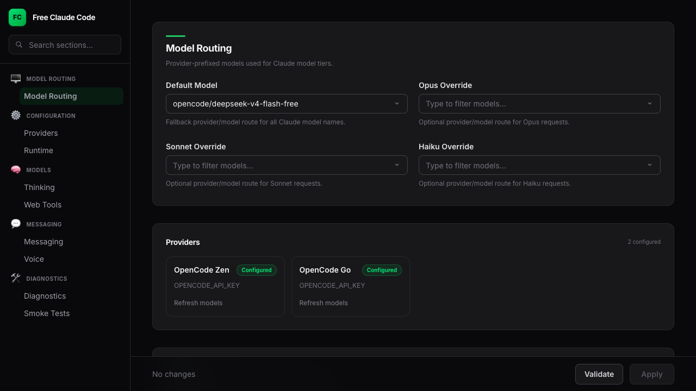
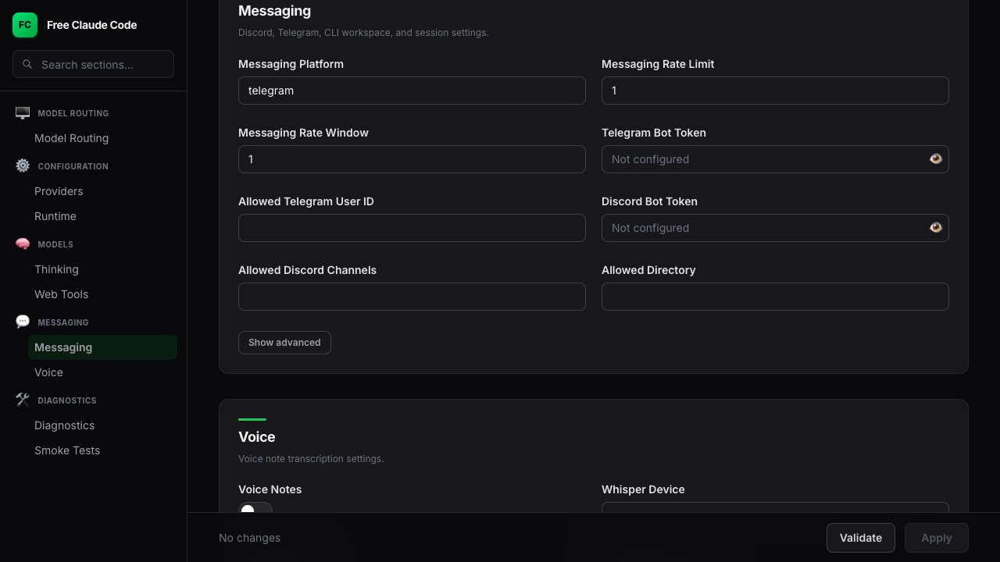

<div align="center">

# 🤖 Free Claude Code

Use Claude Code CLI, Codex CLI, their VS Code extensions, JetBrains ACP, or chat bots through your own provider-backed proxy.

[](https://opensource.org/licenses/MIT)
[](https://www.python.org/downloads/)
[](https://github.com/astral-sh/uv)
[](https://github.com/Alishahryar1/free-claude-code/actions/workflows/tests.yml)
[](https://pypi.org/project/ty/)
[](https://github.com/astral-sh/ruff)
[](https://github.com/Delgan/loguru)

Free Claude Code routes Anthropic Messages API traffic from Claude Code (CLI and VS Code extension) and OpenAI Responses API traffic from Codex (CLI and VS Code extension) to OpenCode gateways. It keeps each client's protocol stable while letting you switch between free and paid models through the same proxy and Admin UI.

[Quick Start](#quick-start) · [Providers](#choose-a-provider) · [Clients](#connect-your-client) · [Integrations](#optional-integrations) · [Development](#development)

</div>

<div align="center">
  
  <p><em>Claude Code running through the Free Claude Code proxy.</em></p>
</div>

<div align="center">
  
  <p><em>Codex CLI using the local FCC Responses provider.</em></p>
</div>

<a id="model-picker"></a>

<div align="center">
  
  <p><em>Claude Code native <code>/model</code> picker with FCC gateway models.</em></p>
</div>

<div align="center">
  
  <p><em>Codex native <code>/model</code> picker with the generated FCC catalog.</em></p>
</div>

## Star History

<div align="center">
  <a href="https://star-history.com/#Alishahryar1/free-claude-code&Date">
    <picture>
      <source media="(prefers-color-scheme: dark)" srcset="https://api.star-history.com/svg?repos=Alishahryar1/free-claude-code&type=Date&theme=dark">
      <source media="(prefers-color-scheme: light)" srcset="https://api.star-history.com/svg?repos=Alishahryar1/free-claude-code&type=Date">
      
    </picture>
  </a>
</div>

## What You Get

- Drop-in proxy for Claude Code's Anthropic API calls (`/v1/messages`, `/v1/models`, `/v1/messages/count_tokens`).
- Drop-in proxy for Codex via the OpenAI Responses API (`/v1/responses`).
- Support for both **Claude Code** and **Codex** CLIs along with their VS Code extensions and JetBrains ACP.
- `fcc-claude` and `fcc-codex` launchers that read the current Admin UI port and auth token each time they start.
- Two provider backends: [OpenCode Zen](#1-opencode-zen) (free-tier and curated models) and [OpenCode Go](#2-opencode-go) (subscription gateway).
- Per-model routing for Claude Code: send Opus, Sonnet, Haiku, and fallback traffic to different providers.
- Native Claude Code `/model` picker support through the proxy's `/v1/models` endpoint.
- Native Codex `/model` picker support when launched through `fcc-codex`, using a generated local model catalog.
- Streaming, tool use, reasoning/thinking block handling, and local request optimizations.
- Optional Discord or Telegram bot wrapper for remote Claude Code sessions.
- Optional usage through the Claude Code VS Code extension and JetBrains ACP.
- Codex CLI and VS Code extension support through the shared `~/.codex/config.toml` provider config.
- Optional voice-note transcription through local Whisper.
- Optional Claude session management, branching, and transcript persistence.
- Local **Admin UI** at `/admin` to edit supported proxy settings, validate changes, and check provider connectivity (loopback access only).

## Quick Start

### 1. Install/Update The Proxy

macOS/Linux:

```bash
curl -fsSL "https://github.com/Alishahryar1/free-claude-code/blob/main/scripts/install.sh?raw=1" | sh
```

Windows PowerShell:

```powershell
irm "https://github.com/Alishahryar1/free-claude-code/blob/main/scripts/install.ps1?raw=1" | iex
```

Review the installers at [scripts/install.sh](https://github.com/Alishahryar1/free-claude-code/blob/main/scripts/install.sh) and [scripts/install.ps1](https://github.com/Alishahryar1/free-claude-code/blob/main/scripts/install.ps1). They install Claude Code and Codex when missing, then install or update the proxy. Re-run these commands to update to the latest version.

To remove only Free Claude Code (not uv, Claude Code, Codex, or the uv-managed Python runtime):

macOS/Linux:

```bash
curl -fsSL "https://raw.githubusercontent.com/Alishahryar1/free-claude-code/main/scripts/uninstall.sh" | sh
```

Windows PowerShell:

```powershell
irm "https://raw.githubusercontent.com/Alishahryar1/free-claude-code/main/scripts/uninstall.ps1" | iex
```

Review [scripts/uninstall.sh](https://github.com/Alishahryar1/free-claude-code/blob/main/scripts/uninstall.sh) and [scripts/uninstall.ps1](https://github.com/Alishahryar1/free-claude-code/blob/main/scripts/uninstall.ps1). They remove the FCC uv tool and always delete `~/.fcc/`. Stop any running `fcc-server`, `fcc-claude`, `fcc-codex`, `fcc-init`, or `free-claude-code` process before uninstalling.

### 2. Start The Proxy

```bash
fcc-server
```

After startup, Uvicorn prints the proxy bind address and the app logs the admin URL:

```text
INFO:     Admin UI: http://127.0.0.1:8082/admin (local-only)
```

Many terminals make these clickable. Use your configured `PORT` if it is not `8082`.

### 3. Open The Admin UI And Configure OpenCode

Open the **Admin UI** URL from the terminal output. The default model is already set to `opencode/deepseek-v4-flash-free`.

<div align="center">
  
</div>

Paste your OpenCode API key into `OPENCODE_API_KEY`, then click **Validate** and **Apply**.

> **Need an API key?** Sign up at [opencode.ai/auth](https://opencode.ai/auth). OpenCode Zen's free tier includes models like `deepseek-v4-flash-free`, `big-pickle`, `gemini-3-flash`, and more.

### 4. Run Your Coding Agent

Keep `fcc-server` running while you work.

**Claude Code**

```bash
fcc-claude
```

`fcc-claude` reads the current configured port and auth token each time it starts, sets the Claude Code environment variables (including a 190k-token `CLAUDE_CODE_AUTO_COMPACT_WINDOW` for auto-compaction), and then launches the real `claude` command. When proxy auth is disabled, it still passes `ANTHROPIC_AUTH_TOKEN=fcc-no-auth` so newer Claude Code versions do not stop at their local login gate before contacting the proxy.

**Codex**

```bash
fcc-codex
```

`fcc-codex` reads the same port and auth token, registers an ephemeral `fcc` model provider that points at the local proxy's `/v1/responses` endpoint, generates a Codex model catalog from the proxy's `/v1/models` response, sets `FCC_CODEX_API_KEY` from the Admin UI auth token, strips official `OPENAI_*` credentials from the child environment, and then launches the real `codex` command. Type `/model` inside Codex to open its native picker. Pass through Codex args as usual, for example `fcc-codex exec "hello"`.

## Choose A Provider

Pick one provider, enter its key in the Admin UI, and set `MODEL` to a provider-prefixed model slug. `MODEL` is the fallback. `MODEL_OPUS`, `MODEL_SONNET`, and `MODEL_HAIKU` can override routing for Claude Code's model tiers.

### 1. [OpenCode Zen](https://opencode.ai/)

Get an API key at [opencode.ai/auth](https://opencode.ai/auth).

In the Admin UI, paste it into `OPENCODE_API_KEY`, then set `MODEL` to an OpenCode Zen model slug such as `opencode/gpt-5.3-codex`. The same `OPENCODE_API_KEY` powers **OpenCode Go** (below); use `opencode_go/` slugs there.

OpenCode Zen is a curated model gateway that provides access to models from Anthropic, OpenAI, Google, DeepSeek, and more through a single API key and OpenAI-compatible endpoint at `https://opencode.ai/zen/v1`.

Popular free models:

- `opencode/deepseek-v4-flash-free` (free)
- `opencode/big-pickle` (free)
- `opencode/gemini-3-flash`

Popular premium models:

- `opencode/gpt-5.3-codex`
- `opencode/claude-sonnet-4`
- `opencode/glm-5.1`
- `opencode/qwen3.5-coder`

Browse available models at [opencode.ai](https://opencode.ai).

### 2. [OpenCode Go](https://opencode.ai/)

Get an API key at [opencode.ai/auth](https://opencode.ai/auth) (same as OpenCode Zen).

In the Admin UI, use `OPENCODE_API_KEY`, then set `MODEL` to an OpenCode Go model slug such as `opencode_go/minimax-m2.7`.

OpenCode Go is a subscription gateway with its own curated catalog and OpenAI-compatible endpoint at `https://opencode.ai/zen/go/v1`. It shares the **same OpenCode API key** as Zen; only the slug prefix (`opencode_go/` vs `opencode/`) and upstream path differ.

Popular examples:

- `opencode_go/minimax-m2.7`
- `opencode_go/claude-sonnet-4`

Browse available models at [opencode.ai](https://opencode.ai).

### 3. Mix Providers By Model Tier

Each model tier can use a different provider by setting `MODEL_OPUS`, `MODEL_SONNET`, and `MODEL_HAIKU` in the Admin UI. Leave a tier blank to inherit `MODEL`. These tier overrides apply to Claude model names that contain `opus`, `sonnet`, or `haiku`. Codex uses the Admin `MODEL` default through `fcc-codex` unless a session requests a provider-prefixed slug directly.

For example, you can route Opus to `opencode/claude-sonnet-4`, Sonnet to `opencode_go/minimax-m2.7`, Haiku to `opencode/deepseek-v4-flash-free`, and keep the fallback `MODEL` on `opencode/big-pickle`.

### 4. Provider Enhancements

**Thinking** — Enable reasoning output per Claude model tier. Each tier can be independently toggled from the Admin UI or `.env`:

- `ENABLE_OPUS_THINKING` — thinking blocks when routing Opus-tier traffic
- `ENABLE_SONNET_THINKING` — for Sonnet-tier traffic
- `ENABLE_HAIKU_THINKING` — for Haiku-tier traffic
- `ENABLE_MODEL_THINKING` — fallback default (default: `true`)

**Proxy support** — Each provider supports per-provider HTTP/SOCKS5 proxy via `OPENCODE_PROXY` and `OPENCODE_GO_PROXY`.

**Rate limiting** — Configure via `PROVIDER_RATE_LIMIT` (default: 1 req), `PROVIDER_RATE_WINDOW` (default: 3 seconds), and `PROVIDER_MAX_CONCURRENCY` (default: 5).

<a id="connect-your-client"></a>

## Connect Your Client

### 1. Claude Code CLI

For terminal use, prefer the installed launcher:

```bash
fcc-claude
```

The Admin UI manages proxy config, restarts the server when runtime settings change, and `fcc-claude` reads the current Admin UI-managed port and auth token every time it starts. It also sets `CLAUDE_CODE_AUTO_COMPACT_WINDOW` to `190000` for auto-compaction. When proxy auth is blank, `fcc-claude` injects `ANTHROPIC_AUTH_TOKEN=fcc-no-auth` only to satisfy Claude Code's local login check; the proxy still treats blank auth as disabled.

### 2. Codex CLI

For terminal use, prefer the installed launcher:

```bash
fcc-codex
```

The installer provisions Codex when it is missing (`npm install -g @openai/codex`). `fcc-codex` injects ephemeral Codex config on every launch:

- `model_provider=fcc`
- `model_providers.fcc.base_url=http://127.0.0.1:<PORT>/v1`
- `model_providers.fcc.env_key=FCC_CODEX_API_KEY`
- `model_providers.fcc.wire_api=responses`
- `model_catalog_json=~/.fcc/codex-model-catalog.json`

The Admin UI auth token is reused as `FCC_CODEX_API_KEY`. Official OpenAI credentials are stripped from the child environment so traffic stays on the local proxy. The generated model catalog lets Codex's native `/model` picker list provider-selectable FCC model slugs. If the catalog cannot be fetched or written, `fcc-codex` warns and still launches without picker injection.

**Advanced manual setup**

If you launch `codex` directly, point it at the proxy with equivalent config:

```bash
codex \
  -c 'model_provider="fcc"' \
  -c 'model_providers.fcc.name="Free Claude Code"' \
  -c 'model_providers.fcc.base_url="http://127.0.0.1:8082/v1"' \
  -c 'model_providers.fcc.env_key="FCC_CODEX_API_KEY"' \
  -c 'model_providers.fcc.wire_api="responses"' \
  exec "hello"
```

Set `FCC_CODEX_API_KEY` to the same value as `ANTHROPIC_AUTH_TOKEN` in the Admin UI.

### 3. Claude Code in VS Code

Install the [Claude Code extension](https://marketplace.visualstudio.com/items?itemName=anthropic.claude-code). Open Settings, search for `claude-code.environmentVariables`, choose **Edit in settings.json**, and add:

```json
"claudeCode.environmentVariables": [
  { "name": "ANTHROPIC_BASE_URL", "value": "http://localhost:8082" },
  { "name": "ANTHROPIC_AUTH_TOKEN", "value": "freecc" },
  { "name": "CLAUDE_CODE_ENABLE_GATEWAY_MODEL_DISCOVERY", "value": "1" },
  { "name": "CLAUDE_CODE_AUTO_COMPACT_WINDOW", "value": "190000" }
]
```

Reload the extension. If the extension shows a login screen, choose the Anthropic Console path once; the local proxy still handles model traffic after the environment variables are active.

### 4. Codex in VS Code

Install the [Codex extension](https://marketplace.visualstudio.com/items?itemName=openai.chatgpt). The extension shares the same user-level Codex config as the CLI (`~/.codex/config.toml` on macOS/Linux, `%USERPROFILE%\.codex\config.toml` on Windows).

Create or edit that file with the `fcc` provider pointing at your local proxy:

```toml
model_provider = "fcc"
model = "opencode/deepseek-v4-flash-free"

[model_providers.fcc]
name = "Free Claude Code"
base_url = "http://127.0.0.1:8082/v1"
env_key = "FCC_CODEX_API_KEY"
wire_api = "responses"
```

Set `model` to your Admin UI `MODEL` value. Replace `8082` if your proxy uses a different `PORT`.

Store the proxy auth token in `~/.codex/auth.json` (or the Windows equivalent):

```json
{
  "FCC_CODEX_API_KEY": "freecc"
}
```

Use the same value as `ANTHROPIC_AUTH_TOKEN` in the Admin UI. Restart VS Code after changing these files. On Windows with WSL-backed Codex, edit the WSL `~/.codex/` files instead and enable `chatgpt.runCodexInWindowsSubsystemForLinux` in VS Code settings when needed.

### 5. Claude Code in JetBrains ACP

Edit the installed Claude ACP config:

- Windows: `C:\Users\%USERNAME%\AppData\Roaming\JetBrains\acp-agents\installed.json`
- Linux/macOS: `~/.jetbrains/acp.json`

Set the environment for `acp.registry.claude-acp`:

```json
"env": {
  "ANTHROPIC_BASE_URL": "http://localhost:8082",
  "ANTHROPIC_AUTH_TOKEN": "freecc",
  "CLAUDE_CODE_ENABLE_GATEWAY_MODEL_DISCOVERY": "1",
  "CLAUDE_CODE_AUTO_COMPACT_WINDOW": "190000"
}
```

Restart the IDE after changing the file.

## Optional Integrations

For every integration below, change **managed proxy settings** only in the **Admin UI** at `/admin`: edit fields, click **Validate**, then **Apply**. The footer shows where the managed config is stored; this README does not walk through editing that file by hand.

### 1. Discord And Telegram Bots

The bot wrapper runs Claude Code sessions remotely, streams progress, supports reply-based conversation branches, session persistence and transcripts, and can stop or clear tasks. Discord and Telegram bots use Claude Code today; use `fcc-codex` or the Codex VS Code extension for Codex sessions.

**Discord**

1. Create the bot in the [Discord Developer Portal](https://discord.com/developers/applications).
2. Enable **Message Content Intent**.
3. Invite the bot with read, send, and message history permissions.
4. Copy the bot token and the numeric channel ID (or IDs) where the bot should respond.

**Telegram**

1. Create a bot with [@BotFather](https://t.me/BotFather) and copy the bot token.
2. Get your numeric user ID from [@userinfobot](https://t.me/userinfobot) so only you can use the bot.

**Configure in the Admin UI**

1. With `fcc-server` running, open the **Admin UI** URL from the terminal output.
2. In the sidebar, choose **Messaging**.
3. Set **Messaging Platform** to `discord`, `telegram`, or `none`.
4. For Discord, paste **Discord Bot Token** and **Allowed Discord Channels**. For Telegram, paste **Telegram Bot Token** and **Allowed Telegram User ID**.
5. Set **Allowed Directory** to an absolute path on the machine running the proxy—the workspace root the bot may use.
6. Click **Validate**, then **Apply**. Restart the server if the UI says one is required.

<div align="center">
  
</div>

<p align="center"><em>Admin UI → Messaging (platform, bots, and Voice)</em></p>

**Useful commands**

- `/stop` cancels a task; reply to a task message to stop only that branch.
- `/clear` resets sessions; reply to clear one branch.
- `/stats` shows session state.

### 2. Voice Notes

Voice notes work on Discord and Telegram after you extend your Free Claude Code install with the local Whisper extra.

macOS/Linux:

```bash
# Local Whisper (CPU or CUDA)
curl -fsSL "https://github.com/Alishahryar1/free-claude-code/blob/main/scripts/install.sh?raw=1" | sh -s -- --voice-local

# Local Whisper with CUDA
curl -fsSL "https://github.com/Alishahryar1/free-claude-code/blob/main/scripts/install.sh?raw=1" | sh -s -- --voice-local --torch-backend cu130
```

Windows PowerShell:

```powershell
# Local Whisper (CPU or CUDA)
& ([scriptblock]::Create((irm "https://github.com/Alishahryar1/free-claude-code/blob/main/scripts/install.ps1?raw=1"))) -VoiceLocal

# Local Whisper with CUDA
& ([scriptblock]::Create((irm "https://github.com/Alishahryar1/free-claude-code/blob/main/scripts/install.ps1?raw=1"))) -VoiceLocal -TorchBackend cu130
```

Restart `fcc-server` after reinstalling.

In the **Admin UI**, open **Messaging** and scroll to **Voice**. Turn on **Voice Notes**, choose **Whisper Device** (`cpu` or `cuda`), set **Whisper Model**, and enter **Hugging Face Token** when your setup needs it.

### 3. Structured Logging & Diagnostics

The proxy supports structured TRACE-level logging that merges ingress, routing, provider, and egress stages into single trace payloads. Enable via Admin UI or `.env`:

- `LOG_RAW_API_PAYLOADS` — log raw API request/response payloads (debug only)
- `LOG_RAW_SSE_EVENTS` — log raw SSE event stream bodies
- `LOG_API_ERROR_TRACEBACKS` — full exception tracebacks on provider errors
- `LOG_RAW_MESSAGING_CONTENT` — log message text previews in messaging adapters
- `LOG_RAW_CLI_DIAGNOSTICS` — log full Claude CLI stderr and parser output
- `LOG_MESSAGING_ERROR_DETAILS` — full exception details in messaging errors

Enabling any of these may log request-derived content. Keep them off in production.

### 4. Network & Agent Config

- `ENABLE_WEB_SERVER_TOOLS` — enable local web search/fetch handling (on by default)
- `WEB_FETCH_ALLOWED_SCHEMES` — restrict fetch to `http,https`
- `WEB_FETCH_ALLOW_PRIVATE_NETWORKS` — allow fetch to private IP ranges (off by default)
- `FAST_PREFIX_DETECTION` — skip prompt re-detection when caching (on by default)
- `ENABLE_NETWORK_PROBE_MOCK` — mock network probe for faster startup (on by default)
- `ENABLE_TITLE_GENERATION_SKIP` — skip auto title generation (on by default)
- `ENABLE_SUGGESTION_MODE_SKIP` — skip suggestion mode (on by default)
- `ENABLE_FILEPATH_EXTRACTION_MOCK` — mock file path extraction (on by default)

## How It Works

<div align="center">
  
</div>

Diagram source: [`assets/how-it-works.mmd`](assets/how-it-works.mmd).

Important pieces:

- **FastAPI** exposes Anthropic-compatible routes (`/v1/messages`, `/v1/messages/count_tokens`, `/v1/models`) plus OpenAI Responses (`/v1/responses`), admin endpoints (`/admin`), and health/control endpoints.
- **Claude Code** sends Anthropic Messages; **Codex** sends OpenAI Responses SSE to the same proxy.
- Responses requests convert to Anthropic Messages internally, then share the same model router, normalizer, and provider adapters.
- `fcc-codex` registers a custom `fcc` provider that points Codex at the local proxy's `/v1/responses` endpoint.
- **Model routing** resolves Claude model names to `MODEL_OPUS`, `MODEL_SONNET`, `MODEL_HAIKU`, or `MODEL`.
- **Transport architecture** — providers use one of two wire protocols:
  - **OpenAI Chat** (`openai_chat`) — translates Anthropic Messages requests to OpenAI Chat Completions format and streams back. Used by OpenCode Zen and OpenCode Go.
  - **Anthropic Messages** (`anthropic_messages`) — native Anthropic wire format for compatible backends.
- The proxy normalizes thinking blocks, tool calls, token usage metadata, and provider errors into the shape each client expects.
- **Request optimizations** answer trivial Claude Code probes locally to save latency and quota.

## Development

### 1. Project Structure

```text
free-claude-code/
├── server.py              # ASGI entry point
├── api/                   # FastAPI routes, service layer, routing, optimizations
│   ├── admin_config/      # Admin UI field definitions and persistence
│   ├── admin_static/      # Admin UI static assets
│   ├── handlers/          # Product-specific request handlers (messages, responses, token count)
│   ├── models/            # Request/response model definitions
│   └── web_tools/         # Local web_search / web_fetch handling
├── core/                  # Shared protocol helpers, SSE, OpenAI Responses
│   ├── anthropic/         # Anthropic Message protocol utilities
│   └── openai_responses/  # Responses ↔ Anthropic conversion and SSE mapping
├── providers/             # Provider runtime, transports, rate limiting
│   ├── opencode/          # OpenCode provider implementation
│   ├── runtime/           # Provider lifecycle, model caching, discovery
│   └── transports/        # Wire protocol transports (openai_chat, anthropic_messages)
├── messaging/             # Discord/Telegram runtimes, sessions, transcripts
│   ├── platforms/         # Platform adapters (discord, telegram)
│   ├── rendering/         # Platform-specific markdown rendering
│   ├── session/           # Chat session management and persistence
│   ├── transcript/        # Conversation transcript pipeline
│   └── trees/             # Conversation branching graph
├── cli/                   # Package entry points and client CLI process management
│   ├── launchers/         # Claude Code / Codex launcher CLIs
│   └── managed/           # Managed CLI session for bot workflows
├── config/                # Settings, provider catalog, logging
└── tests/                 # Unit and contract tests
```

### 2. Run From Source

Use this path if you are developing or want to run directly from a checkout:

```bash
git clone https://github.com/Alishahryar1/free-claude-code.git
cd free-claude-code
uv run uvicorn server:app --host 0.0.0.0 --port 8082 --timeout-graceful-shutdown 5
```

### 3. Commands

Run the local CI sequence (requires `uv` on PATH). The local scripts format
Python files and apply autofixable Ruff lint fixes before type checking and
tests:

```bash
./scripts/ci.sh
```

```powershell
.\scripts\ci.ps1
```

Useful flags: `--only pytest`, `--skip pytest`, `--dry-run` (PowerShell: `-Only pytest`, `-Skip pytest`, `-DryRun`).

Or run individual repair/check commands manually:

```bash
uv run ruff format
uv run ruff check --fix
uv run ty check
uv run pytest -v --tb=short
```

GitHub CI remains check-only for Ruff with `uv run ruff format --check` and
`uv run ruff check`, so required status checks verify committed code.

CI also enforces a ban on `# type: ignore` / `# ty: ignore` suppressions; `scripts/ci.sh` and `scripts/ci.ps1` run that grep too.

### 4. Package Scripts

`pyproject.toml` installs:

- `fcc-server`: starts the proxy with configured host and port.
- `fcc-init`: optional advanced scaffold for `~/.fcc/.env`; prefer the **Admin UI** for normal configuration.
- `fcc-claude`: launches Claude Code with the configured local proxy URL, an auth-token env var or `fcc-no-auth` sentinel, model discovery flag, and a 190k `CLAUDE_CODE_AUTO_COMPACT_WINDOW` for auto-compaction.
- `fcc-codex`: launches Codex with ephemeral `fcc` provider config pointing at the local proxy's `/v1/responses` endpoint, a generated native `/model` picker catalog, and `FCC_CODEX_API_KEY` from the Admin UI auth token.
- `free-claude-code`: compatibility alias for `fcc-server`.

### 5. Extending

- Add OpenAI-compatible providers by extending `OpenAIChatTransport`.
- Add Anthropic Messages providers by extending `AnthropicMessagesTransport`.
- Extend OpenAI Responses conversion in `core/openai_responses/` when Codex adds new request or stream shapes.
- Register provider metadata in `config.provider_catalog` and factory wiring in `providers.runtime.factory`.
- Add messaging platforms by wiring runtime, outbound, and inbound-normalizer ports in `messaging/platforms/`.

## Contributing

- [`.env.example`](.env.example) lists env key names as a read-only reference for contributors; use the **Admin UI** to change managed proxy settings.
- Report bugs and feature requests in [Issues](https://github.com/Alishahryar1/free-claude-code/issues). For bugs, always include all model mapping, current model when the issue occurred, and the error string.
- Keep changes small and covered by focused tests.
- Do not open Docker integration PRs.
- Do not open README change PRs — just open an issue for it.
- Run the full check sequence before opening a pull request.
- The syntax `except X, Y` is brought back in Python 3.14 final version (not in 3.14 alpha). Keep in mind before opening PRs.

## License

MIT License. See [LICENSE](LICENSE) for details.
